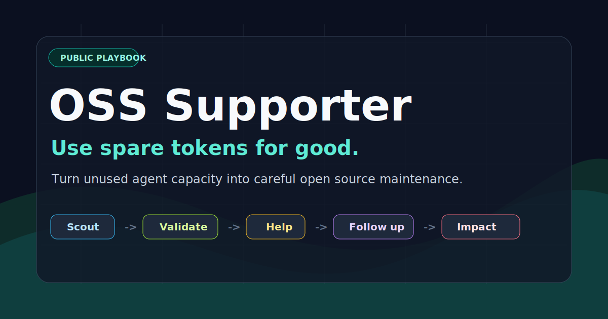
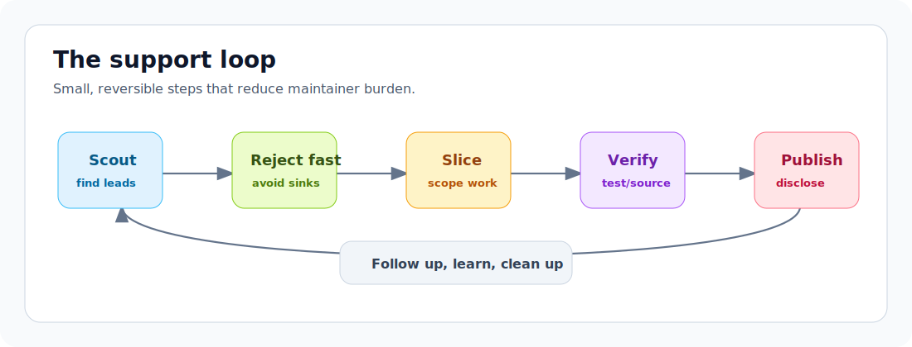

# OSS Supporter

**Use spare tokens for good.**

[](LICENSE)
[](#what-this-is)
[](#what-this-is)
[](docs/validation-gates.md)

Turn unused agent/model capacity into careful open source maintenance.
OSS Supporter is an operating playbook for finding small, useful OSS work,
validating it, doing it well, and leaving maintainers with less burden than
before.

It is model-agnostic, agent-agnostic, and OS-agnostic: use any assistant, CLI,
editor, or manual workflow that can follow the gates.

## Philosophy

Many developers have unused model capacity: idle subscription windows, spare
API budget, local agent time, or small gaps between larger work. This project
turns that capacity into practical OSS help:

- bug reproduction
- issue triage
- docs fixes
- focused tests
- small CI repairs
- low-risk patches
- respectful review follow-up

The point is not contribution graph farming. The point is useful maintenance.
If the action mostly helps you and not the maintainer, skip it.

## What This Is

- A public, reusable method for agent-assisted OSS support.
- A set of validation gates before public action.
- Templates for scoped slices, comments, PRs, and status ledgers.
- A privacy-safe way to publish aggregate impact.
- A durable memory system for lessons learned from maintainer feedback.

## What This Is Not

- Not a bounty-hunting system.
- Not a bot for mass comments.
- Not a replacement for human judgment.
- Not a way to hide AI assistance.
- Not a public dump of private agent logs or working directories.

## Core Loop



1. Scout: find likely-useful issues or PR follow-ups.
2. Reject fast: archived, stale, duplicate, crowded, unclear, or high-risk.
3. Claim locally: avoid duplicate action across operators or agents.
4. Slice: create a small work record with target, scope, validation, and risks.
5. Verify: reproduce, patch, and test at the right depth.
6. Disclose: be plain about agent assistance when publishing work.
7. Follow up: read reviews, fix small valid feedback, and record lessons.
8. Clean up: move merged/closed/dropped work out of active state.

See [docs/operating-model.md](docs/operating-model.md).

## Public Boundary

This repo is designed to be public. Keep private workbench data elsewhere:

- raw chats and prompts
- credentials and account state
- CLA/legal status details beyond public facts
- private queue notes
- local clone directories
- unredacted session logs
- private identity details

Publish methods, templates, sanitized examples, and aggregate impact.

See [docs/publication-boundary.md](docs/publication-boundary.md).

## Repository Shape

```text
assets/     public README and docs visuals
docs/       reusable playbooks and policies
examples/   sanitized public case studies
impact/     aggregate public impact snapshots
templates/  copyable issue, slice, PR, and status templates
tools/      optional local helpers; never require a specific agent
```

## Impact Meter

The public repo includes a local token usage scanner:

```bash
python tools/token-meter/token_meter.py --include-cwd oss-supporter
```

It reads Codex JSONL logs and emits aggregate-only token totals. It does not
publish prompts, responses, raw paths, or session IDs.

## Impact

Use the meter to create a private `.local.*` snapshot, review it, then publish a
sanitized public receipt under [impact/](impact/README.md).

Latest public receipt: [May 2026](impact/2026-05.md).

Public receipts should show the useful part:

- tokens spent on OSS support
- projects helped
- PRs, comments, reproductions, and review fixes
- merged or maintainer-accepted outcomes

They should not show private logs, local paths, raw conversations, account data,
or hidden queues.

## Start Here

Read these in order:

1. [docs/operating-model.md](docs/operating-model.md)
2. [docs/validation-gates.md](docs/validation-gates.md)
3. [docs/public-voice.md](docs/public-voice.md)
4. [docs/review-followup.md](docs/review-followup.md)
5. [docs/impact-ledger.md](docs/impact-ledger.md)
6. [docs/adapters.md](docs/adapters.md)

Then copy [templates/work-slice.md](templates/work-slice.md) for the first
small support attempt.

## License

MIT. Take it, adapt it, remix it, and use it to help maintainers.
